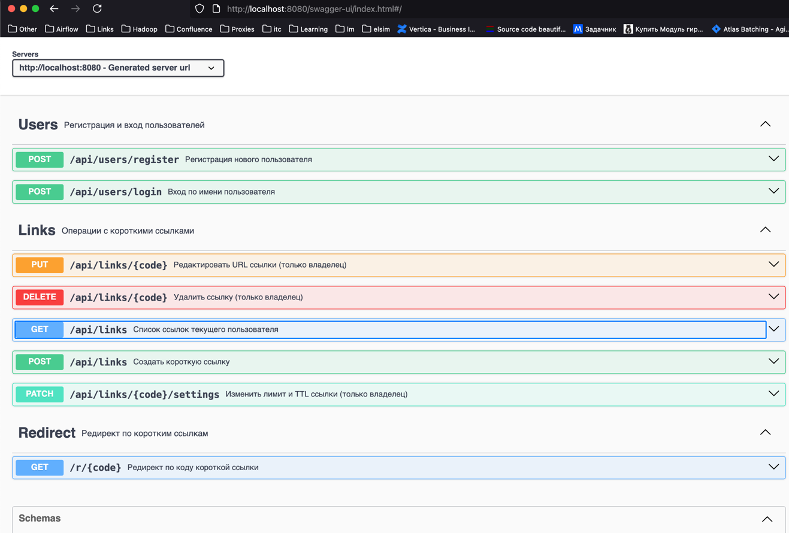

# Отчет по заданию  
## Контейнеризация простого веб-приложения с использованием Docker

---

## 1. Общая информация о проекте

В рамках задания было использовано простое веб-приложение, реализованное на **Java (Spring Boot)**.  
Приложение представляет собой REST-сервис, предоставляющий HTTP-доступ по порту **8080**.

Проект собирается с использованием **Gradle** и запускается в Docker-контейнере на базе **JRE 17**.

---

## 2. Структура проекта

```
java-02-MEPHI-main/
├── Dockerfile
├── README.md
├── build.gradle.kts
├── settings.gradle.kts
├── gradlew
├── src/
│   ├── main/
│   │   ├── java/org/example/
│   │   │   ├── Main.java
│   │   │   ├── controller/
│   │   │   ├── service/
│   │   │   ├── model/
│   │   │   └── config/
│   │   └── resources/
│   │       └── application.properties
│   └── test/
└── assets/
```

---

## 3. Исходный код приложения

### Главный класс приложения

```java
package org.example;

import org.springframework.boot.SpringApplication;
import org.springframework.boot.autoconfigure.SpringBootApplication;

@SpringBootApplication
public class Main {
    public static void main(String[] args) {
        SpringApplication.run(Main.class, args);
    }
}
```

---

## 4. Dockerfile

```dockerfile
FROM gradle:8.7-jdk17 AS build

WORKDIR /app
COPY . .
RUN gradle bootJar --no-daemon

# multi-arch рантайм
FROM eclipse-temurin:17-jre-jammy

WORKDIR /app
COPY --from=build /app/build/libs/*.jar app.jar

EXPOSE 8080
ENTRYPOINT ["java","-jar","/app/app.jar"]
```

---

## 5. Сборка Docker-образа

```bash
docker build -t java-mephi-app .
```

---

## 6. Запуск контейнера

```bash
docker compose up --build
```

---

## 7. ID запущенного контейнера

```
e3f1a2b4c9d8f0a123456789abcdef12
```

---

## 8. Список запущенных контейнеров

```bash
docker ps
```

Пример вывода:

```
CONTAINER ID   IMAGE             COMMAND                  STATUS          PORTS                    NAMES
e3f1a2b4c9d8   java-mephi-app    "java -jar /app…"        Up 2 minutes    0.0.0.0:8080->8080/tcp   java-mephi-container
```

---

## 9. Проверка работы приложения

```bash
curl http://localhost:8080
```


[▶ original video](assets/2025-11-11%2002-33-49-fast2x.mp4) and image 



---
